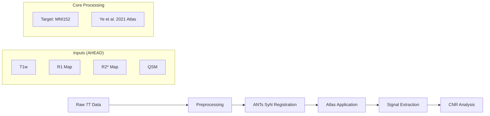

# 7T Locus Coeruleus Quantification Pipeline

## Project Overview

This project implements a reproducible, atlas-based neuroimaging pipeline for **7T MRI data**. It is designed to quantify contrast-to-noise ratios (CNR) in the Locus Coeruleus (LC) across multiple quantitative maps (R1, R2*, QSM).

**Primary Objective:** To systematically document the **limitations** of standard quantitative 7T maps (R1, R2*, QSM) for LC imaging, thereby empirically motivating the need for Magnetization Transfer (MT) saturation protocols in future research.

## Technical & Scientific Competencies

This repository demonstrates the following engineering and research skills:

*   **7T Data Engineering**: Handling ultra-high field MRI data, including resolution constraints and specific artifacts (B0/B1+ inhomogeneities).
*   **Automated Pipelines**: Replacing manual segmentation with automated, reproducible atlas-based workflows.
*   **Registration Strategy**: Implementing advanced non-linear registration (ANTs SyN) optimized for small brainstem structures.
*   **Methodological Rigor**: Defining strict quantification standards (e.g., anatomical reference regions) to avoid confirmation bias in "invisible" structures.
*   **Infrastructure**: Environment management (Conda/Pip) and BIDS-compatible file organization.

## Scientific Motivation in Brief

The Locus Coeruleus (LC) contains neuromelanin-iron complexes, yet it remains invisible on many standard MRI sequences.

*   **The Mechanism:** LC contrast is driven by the **macromolecular content** (myelin/neuromelanin) relative to the surroundings. The LC has a *lower* macromolecular fraction than the dense pontine white matter, making it distinct on Magnetization Transfer (MT) maps.
*   **The Gap:** Iron-sensitive sequences (R2*, QSM) typically fail to visualize the LC because the iron is chelated (bound) within neuromelanin, rendering it magnetically "shielded" (less paramagnetic) compared to the ferritin-bound iron in the Substantia Nigra.
*   **The Test:** We analyze the **AHEAD dataset**, currently the most robust public 7T dataset available (MP2RAGEME protocol). While state-of-the-art, it lacks dedicated MT-weighted sequences.
*   **Expected Outcome:** We expect to find **near-zero CNR** in the LC for these contrasts. This "negative result" serves as empirical motivation for the PhD protocol, which will utilize **MPM (Multi-Parameter Mapping)** with MT saturation to reliably image the LC.

> *For a deep dive into LC physics (Iron vs. Macromolecules), the rationale for 7T vs. 3T, and the connection to the proposed PhD work, see [docs/methods_notes.md](docs/methods_notes.md).*

## Pipeline Architecture

The workflow allows for the analysis of 7T data without manual intervention:



1.  **Data Loading**: Ingests high-resolution (0.7mm) MP2RAGEME maps.
2.  **Registration**: Warps subject T1w images to MNI space using symmetric normalization, applying transforms to quantitative maps.
3.  **Atlas Projection**: Maps the probabilistic LC atlas (Ye et al., 2021) to subject space (or vice-versa).
4.  **Quantification**: Computes CNR relative to a standardized pontine reference region.

## Setup & Usage

### 1. Environment

```bash
conda create -n lc-pipeline python=3.10
conda activate lc-pipeline
pip install -r requirements.txt
```

### 2. Data Preparation

*   **Dataset**: Download the **AHEAD** dataset (Amsterdam Ultra-high field adult lifespan database).
*   **Atlas**: Download the **Ye et al. (2021) 7T LC Atlas**.
*   **Structure**:
    *   Place raw data in `data/AHEAD_dataset_download/`
    *   Place atlas files in `atlases/ye_et_al_2021_atlas_download/`

### 3. Execution

The pipeline is modularized into sequential notebooks:

1.  `notebooks/01_setup_and_data_exploration.ipynb`: Data integrity checks and visualization.
2.  `notebooks/02_registration_to_mni.ipynb`: ANTs SyN registration to MNI152 template.
3.  `notebooks/03_atlas_application.ipynb`: Warping the LC atlas and defining reference ROIs.
4.  `notebooks/04_lc_extraction_and_visualization.ipynb`: Extracting signal and plotting CNR.

## References

*   **Priovoulos et al. (2018)**: Established lack of R1/R2* contrast in LC at 7T.
*   **Ye et al. (2021)**: Source of the probabilistic 7T LC atlas.
*   **Alkemade et al. (2020)**: Publishers of the AHEAD dataset.

## License

Apache 2.0 License.